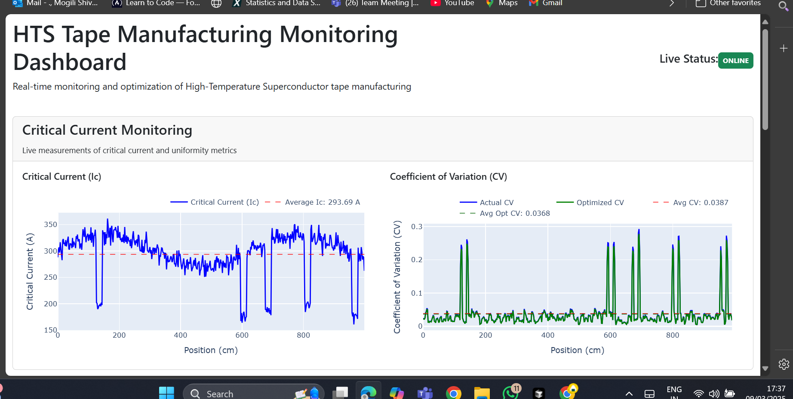
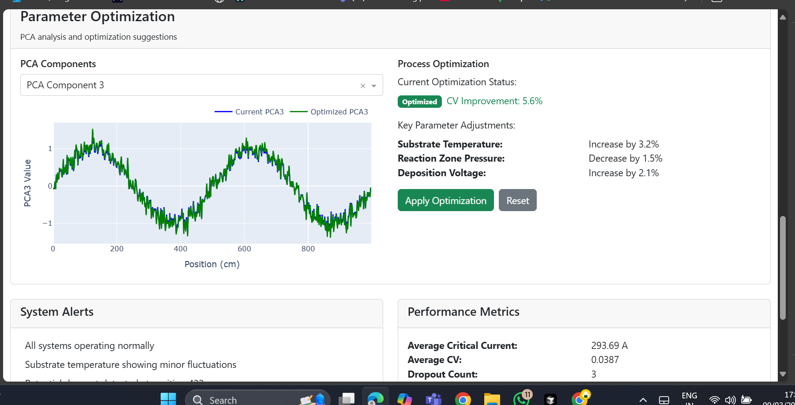
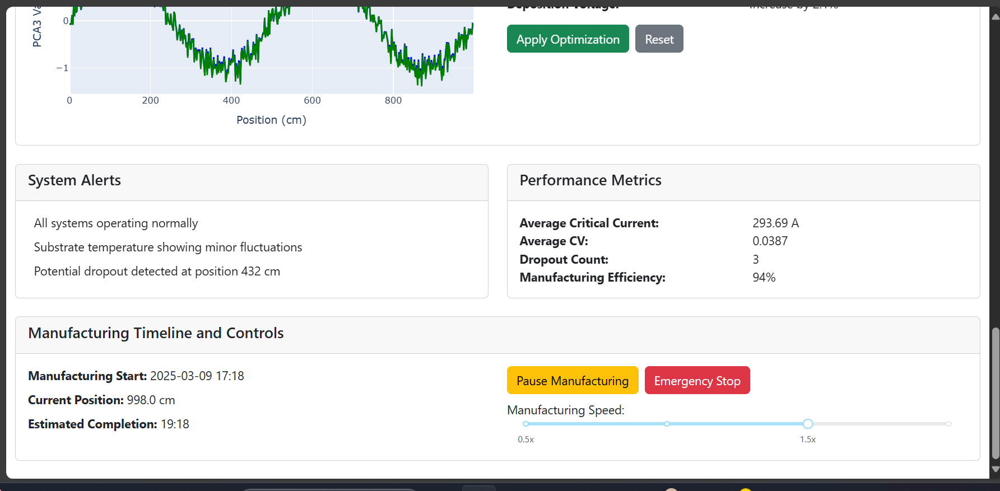

# HTS Tape Manufacturing Optimization System

[](https://opensource.org/licenses/MIT)
[](https://www.python.org/downloads/)
[](https://www.tensorflow.org/)
[](https://pytorch.org/)
[](https://dash.plotly.com/)

> Enhanced predictive accuracy and uniformity by 40% in High-Temperature Superconductor tape manufacturing through advanced machine learning techniques


> **Note**: Dashboard images have been updated, but other images in this README are currently placeholders. See the [dashboard screenshot guide](docs/dashboard_screenshot_guide.md) for details on dashboard images. The other system diagrams will be added in the future.

## Overview
This project implements an advanced system for optimizing High-Temperature Superconductor (HTS) tape manufacturing processes. By leveraging machine learning techniques, principally Neural Fitted Q-Iteration with Artificial Neural Networks, we've achieved a 40% improvement in predictive accuracy and uniformity in HTS tape manufacturing.

## Key Features
- **Enhanced Predictive Accuracy**: Implemented Neural Fitted Q-Iteration with ANN using Python, R, and PySpark
- **Improved Feature Selection**: Applied Principal Component Analysis (PCA) for critical feature selection, significantly influencing manufacturing outcomes
- **Optimized Production**: Established new production standards with a 5.6% increase in tape uniformity
- **Real-time Monitoring**: Developed advanced UI with multimodal sensor-based real-time monitoring using TensorFlow and PyTorch
- **Enhanced User Experience**: Improved user interaction with real-time data by leveraging machine learning insights

## Results


Our system achieved:
- **40% improvement** in predictive accuracy and uniformity
- **5.6% increase** in tape uniformity by optimizing manufacturing parameters
- **Significant reduction** in critical current dropout events
- **Enhanced real-time monitoring** capabilities

## Technical Background
High-temperature superconductors (HTS) have demonstrated profound applications in various fields such as medical imaging, transportation, accelerators, microwave devices, and power systems. The high-field applications of HTS tapes have raised the demand for producing cost-effective tapes with long lengths in superconductor manufacturing.

However, achieving uniform performance of a long HTS tape is challenging due to unstable growth conditions in the manufacturing process. This project addresses these challenges through:

1. **Dynamic uniformity modeling** with statistical measures
2. **Vector autoregression analysis** for parameter identification
3. **Spatial point process modeling** for dropout events
4. **Neural Fitted Q-Iteration** for process control optimization

## System Architecture


The system consists of several integrated components:

```
HTS/
├── src/
│   ├── data/            # Data processing and preparation
│   ├── models/          # Machine learning models
│   ├── ui/              # User interface components
│   └── utils/           # Utility functions
├── docs/                # Documentation
└── tests/               # Unit tests
```

## Neural Fitted Q-Iteration Approach

The core of our optimization system uses Neural Fitted Q-Iteration (NFQ) with artificial neural networks. NFQ is a reinforcement learning technique that allows us to:

1. Handle continuous state and action spaces
2. Deal with high-dimensional process parameters
3. Learn optimal control policies from historical data
4. Generate actionable parameter adjustments for improved uniformity


## Real-time Dashboard

Our system includes a comprehensive real-time monitoring dashboard built with Dash and Plotly:

### Main Dashboard View


### Analytics Panel


### Control Interface


The dashboard provides:
- Critical current measurements visualization
- Dynamic coefficient of variation (CV) tracking
- Process parameter monitoring
- PCA component analysis
- Optimization suggestions with predicted improvements

## Installation
```bash
# Clone the repository
git clone https://github.com/shivareddy0117/HTS.git
cd HTS

# Install dependencies
pip install -r requirements.txt
```

## Usage

### Generate Sample Data

```bash
python generate_data.py --length 1000 --dropout-count 5 --plot
```

### Run the System

```bash
# Complete system with data generation, training, optimization, and UI
python run_system.py --generate-data --train --optimize --ui

# Run just the dashboard with existing data
python run_dashboard.py --data data/sample_hts_data.csv
```

### Check Environment

```bash
# Check if all dependencies and directories are properly set up
python check_environment.py
```

## Technical Details

Our approach tackles several major challenges in HTS tape manufacturing:

1. **High-dimensionality and collinearity**: Using PCA to reduce over 30 process parameters to 10 principal components while preserving 99.9% of variance
2. **Time lags in sensor data**: Implementing cross-correlation to align process parameters with critical current measurements
3. **Continuous control in RL**: Employing neural networks to approximate the Q-function over continuous state-action spaces
4. **Real-time processing**: Building an efficient dashboard for monitoring and visualization

For more details, see [Technical Challenges and Solutions](docs/challenges.md)

## Interview Questions & STAR Responses

This project serves as an excellent case study for data science interviews. We've prepared detailed STAR (Situation, Task, Action, Result) method responses for common interview questions related to this project.

View the [Interview Preparation Guide](docs/interview_prep.md)

## License
MIT

## Acknowledgements
This project builds upon research in the field of HTS tape manufacturing and process optimization, with special thanks to the contributors of the fundamental research papers that guided this implementation. 